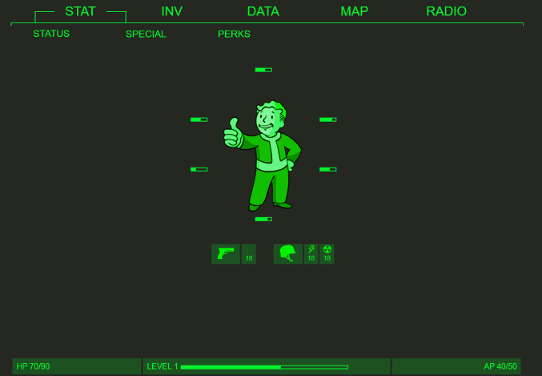
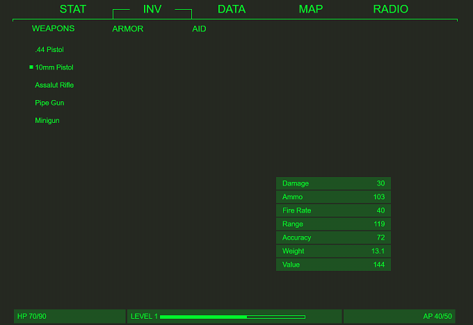

<h1>PipBoy</h1>

<h3>Description</h3>

Simple project inspired by PipBoy from Fallout 4. 
Minimal width is set to 900px - main goal was to look like Pipboy,not fully responsible website.

 

Only STAT and INV tabs are ready and interactive.
  

 
<h3>Tech/framework used</h3>
<ul>
  <li>HTML</li>
  <li>CSS</li>
  <li>JavaScript</li>
 </ul>
 
  
<h3>Goal</h3>
 Practise using HTML,CSS,JavaScript

 
<h3>Screenshots</h3>
</img>
Status example
 
</img>
Inventory example
 
<h3>Live</h3>
Soon...
